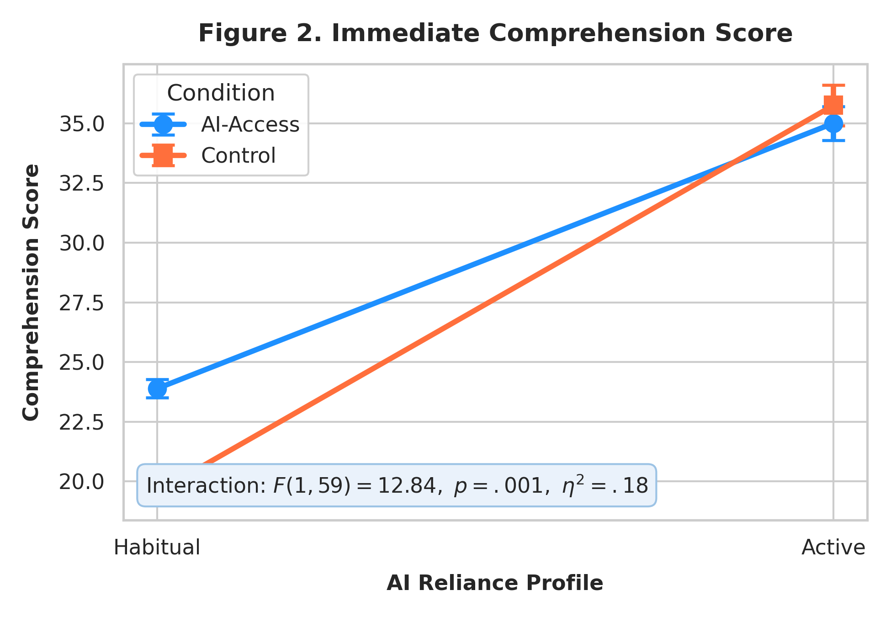
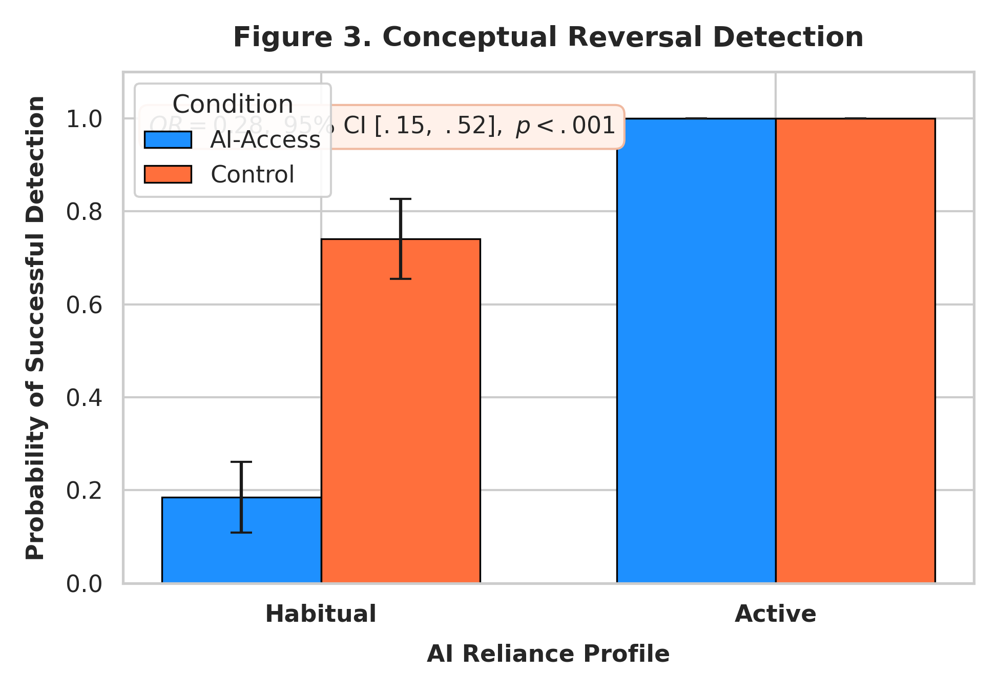
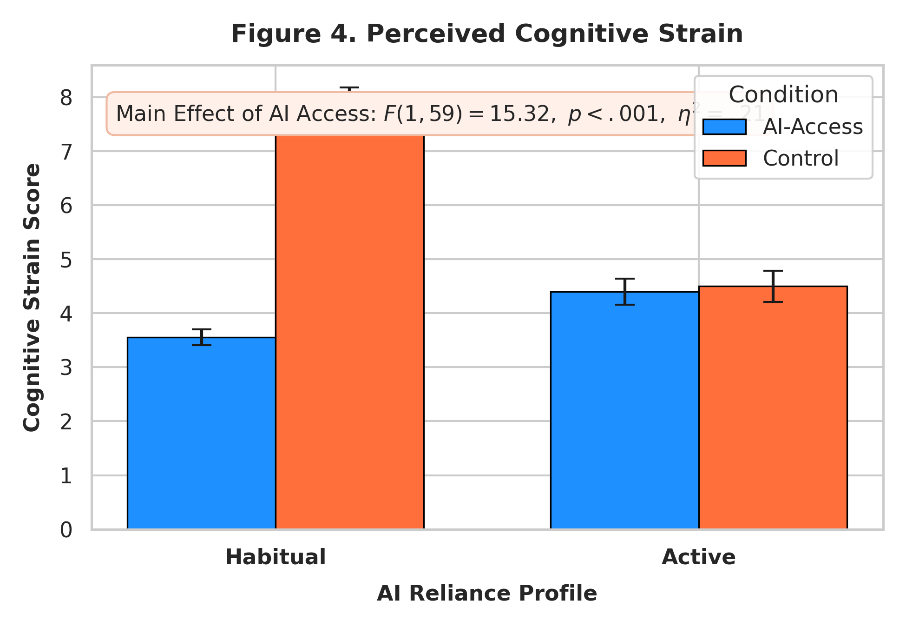
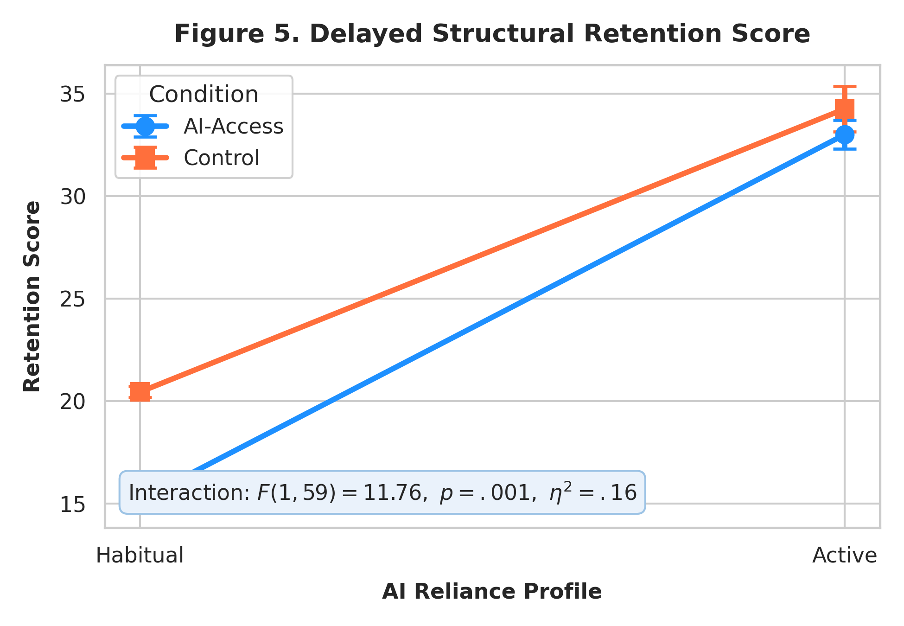

# The Cognitive Cost of Cognitive Offloading: Generative AI, Learner Profiles, and Reading Comprehension

[](https://doi.org/10.5281/zenodo.placeholder)
[](https://creativecommons.org/licenses/by/4.0/)
[](#analysis--reproducibility)
[-orange.svg)](#citation)

Official open-science research repository for the empirical study investigating the cognitive trade-offs of generative AI in academic reading comprehension across differentiated learner profiles.

---

## 📌 Graphical Abstract & Methodology

### Graphical Abstract
<p align="center">
  
</p>

### Figure 1: Experimental Methodology Pipeline
<p align="center">
  
</p>
*Figure 1: Multi-stage experimental workflow (Screening, Reading Task, and Multi-Dimensional Evaluation).*

---

## 📈 Empirical Outcomes

| Immediate Comprehension | Conceptual Reversal Detection |
| :---: | :---: |
|  |  |
| **Figure 2:** Immediate comprehension by condition & profile | **Figure 3:** Reversal error detection probability |

| Cognitive Strain | Delayed Structural Retention |
| :---: | :---: |
|  |  |
| **Figure 4:** Subjective cognitive strain (NASA-TLX) | **Figure 5:** 1-week delayed structural retention scores |

---

## 📊 Summary of Key Empirical Findings ($N=63$)

The experimental phase evaluated the differential impacts of generative AI assistance across two primary learner profiles: **Habitual AI Users** vs. **Active Learners** under two experimental conditions (**AI-Access** vs. **Control**).

| Outcome Metric | Statistical Test | Test Statistic | Effect Size | $p$-value | Core Interpretation |
| :--- | :--- | :--- | :--- | :--- | :--- |
| **Immediate Comprehension** | Two-way ANOVA ($2 \times 2$) | $F(1, 59) = 12.84$ | $\eta_p^2 = 0.18$ | $.001$ | AI provides short-term gains, predominantly for habitual users. |
| **Conceptual Reversal Detection** | Binary Logistic Regression | Wald $\chi^2 = 14.72$ | $\text{OR} = 0.28$ | $< .001$ | AI-reliant users show a 72% reduction in detecting critical textual inconsistencies. |
| **Cognitive Strain (NASA-TLX)** | Independent Samples $t$-test | $t(61) = -4.12$ | Cohen's $d = 1.04$ | $< .001$ | Habitual AI reliance significantly dampens active cognitive effort. |
| **Delayed Retention (1-Week)** | Two-way ANOVA ($2 \times 2$) | $F(1, 59) = 15.32$ | $\eta_p^2 = 0.21$ | $< .001$ | Severe decay in deep structural retention when AI scaffolding is removed. |
| **Strain–Retention Coupling** | Pearson Correlation | $r = -.68$ | $R^2 = 0.46$ | $< .01$ | Cognitive engagement during reading is necessary for long-term schematic storage. |

---

## 💡 Conclusion & Key Takeaways

1. **The "Illusion of Competence":** Generative AI creates an immediate performance boost during reading comprehension tasks. However, this superficial fluency masks a profound lack of deep semantic encoding.
2. **Critical Vulnerability in Error Detection:** Habitual AI reliance causes users to bypass critical cognitive checkpoints, leading to a failure to identify deliberately inverted conceptual claims (*Conceptual Reversal*).
3. **Cognitive Offloading Trade-Off:** The reduction in subjective cognitive strain comes at the direct expense of long-term structural retention. When the AI crutch is removed after a one-week delay, habitual users demonstrate marked memory collapse.
4. **Pedagogical Implication:** AI integration in education must shift from passive offloading tools to cognitive prompting mechanisms that enforce active cognitive engagement and critical evaluation.

---
🛠 Analysis & Reproducibility
Python Environment
bash
conda env create -f environment.yml
conda activate cognitive-offloading
jupyter notebook
R Pipeline Execution
R
source("R_scripts/00_install_dependencies.R")
source("R_scripts/01_descriptives.R")
source("R_scripts/02_screening_anova.R")

---
📖 Citation
If you use the datasets, analysis scripts, or figures from this repository, please cite:

APA Format
Merrikhi, P. (2026). The Cognitive Cost of Cognitive Offloading: Generative AI, Learner Profiles, and Reading Comprehension. Educational Technology & Society (Under Review). DOI: 10.5281/zenodo.placeholder
---
BibTeX
bibtex
@article{merrikhi2026cognitive,
  title={The Cognitive Cost of Cognitive Offloading: Generative AI, Learner Profiles, and Reading Comprehension},
  author={Merrikhi, Pegah},
  journal={Educational Technology \& Society},
  year={2026},
  doi={10.5281/zenodo.placeholder},
  url={https://github.com/Pegi1727/cognitive-offloading-study}
}
---
📜 License
This repository is licensed under the Creative Commons Attribution 4.0 International (CC BY 4.0) license. Datasets and code are openly accessible for scientific verification and reproduction.
---
Author: Pegah Merrikhi, Ph.D.

Contact: pegah.merrikhiii@gmail.com

## 📁 Repository Structure
```text
├── Figures/                               # High-resolution (300 DPI) publication figures
│   ├── graphical abstarctt.png            # Graphical Abstract
│   ├── figure 1.png                       # Methodology Pipeline
│   ├── Figure_2_Immediate_Comprehension_v2.png
│   ├── Figure_3_Conceptual_Reversal_Detection_v2.png
│   ├── Figure_4_Cognitive_Strain_v2.png
│   └── Figure_5_Delayed_Structural_Retention_v2.png
├── data/                                  # Open-access datasets
│   ├── raw/
│   │   ├── screening_data.xlsx            # Initial screening cohort (N=90)
│   │   └── experimental_phase_data.xlsx   # Experimental dataset
│   └── processed/
│       ├── screening_data.pkl             # Serialized Python datasets
│       ├── experimental_phase_data.pkl
│       └── experimental_phase_data_clean.xlsx
├── notebooks/                             # Jupyter notebooks for interactive replication
│   ├── 01_Data_Cleaning.ipynb
│   ├── 02_Descriptive_Analysis.ipynb
│   └── 03_Inferential_Analysis.ipynb
├── R_scripts/                             # Reproducible R pipelines
│   ├── 00_install_dependencies.R
│   ├── 01_descriptives.R
│   ├── 02_screening_anova.R
│   └── 03_validation.R
├── config.yaml
├── environment.yml
└── README.md
